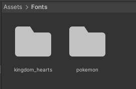

# GDD

### PRESENTACIÓN/RESUMEN

- Título: Pokemon - Santiago de Compostela. 
- Concepto: Es un juego basado en pokemon, que tiene como objetivo acabar la universidad de Santiago de compostela
- Género: RPG ( role-playing game )
- Público: Mayores de 16 años
- Plataforma: Windows
- URL GitHub: https://github.com/IvanCPO/DAM_UF2_Proyecto

## GAMEPLAY

#### Objetivos

Descripción de cuáles son los objetivos principales (y secundarios si los hay) del juego

ACTUALMENTE el juego estaria incompleto por falta de tiempo por que abarcara un mundo muy grande con muchas misiones, por lo tanto hare que consiga su primer pokemon para poder salir de la zona de inicio y se podran realizar combates por el medio. Este seria como el tutorial del juego pero nos sirve para nuestro proyecto, ya que recoge las ideas principales del juego original. El juego, aparte de tener combates, tiene una historia de fondo y el jugador deberá de avanzar para cumplir su objetivo, ganar a los lideres de gimnasio(Pubs/Examenes) y ganar en la liga para ser reconocido como campeon (Aprovar en la universidad), pero como dije antes esto ultimo seria imposible actualmente y se intentara alcanzar en el proyecto final de este ciclo formativo.

#### Historia

El jugador, que vive con su abuela, pertenece al pueblo humilde de O Grove, y recibe una invitación para formar parte en la formación profesional de entrenadores pokemon. Cuando lo escucha del profesor de su pueblo, se dirige a Santiago, donde se centrará la historia.

#### Jugabilidad

Descripción de la interacción y experiencia del jugador. Sistemas de premios o recompensas. Puzzles,...

El jugador se movera en el juego con las teclas A(izquierda), D(derecha), W(arriba), S(abajo) y se usara shift para correr.

Abra una parte que es para las interaciones que sera a partir de colisiones del jugador con los elemntos o NPCS del juego. Luego tanto los menus como el sistema de combate se hará a base de clickar botones que estaran en la pantalla.

### Progresión

Actualmente no existen tales fases, pero en un futuro cada vez que avances en la historia apareceran mas pokemons con mas movimientos y mas nivel que incrementara la dificultad del juego. Actualmente hay un spawn enfrente de la estatua del centro del pueblo que es donde se generan los combates de ejemplo.

### GUI

Descripción del GUI y de la información mostrada al jugador durante el desarrollo de la partida

Habra un menu desplegable en forma de boton que permitira acceder a las opciones del juego: Ver pokemons del equipo, ver tu identificador y salir del menu de interacciones. En un futuro tendra las opciones tipicas de pokemon como opciones, pokedex, mochila y el guardado.

## MECÁNICAS

- Reglas: Para ganar debes de debilitar al rival y pierdes cuando debilitan a todo tu equipo completo. Atacara antes el mas rapido y el daño que provoque vendra de un calculo rapido a partir de todas las estadisticas del juego. El jugador tendra la opcion de abandonar el combate.
Además, los ataques se haran a turno, y eso dependera de la velocidad del pokemon. El más rapido ataca antes.

- Interacción: 
Para mover al jugador: teclas A(izquierda), D(derecha), W(arriba), S(abajo) y se usara shift para correr.
Para saltar dialogos: tecla space.
Para interactuar: colisionar con el objeto.
Para interactuar con botones: click sobre elementos (menu, combate, opciones)

- Puntaje: La cantidad debe de ser mayor que 0, si no pierdes y reapareces en el pueblo

- Dificultad: Habra pokemons de distinto nivel al tuyo y puede que sean de mas alto nivel y puede que sepan un movimiento que te haga especial daño a ti, con lo que te puede debilitar.

## ELEMENTOS DEL VIDEOJUEGO

Caracterización del mundo/entorno en el que se desarrolla el videojuego (Worldbuilding). Puede incluir:

- Leyes físicas: el jugador chocara con los elementos tangibles como casas y columnas. No se necesitara RigidBody, ya que a mi solo me interesa que colisionen.

- Historia: Joven estudiante de programacion/entrenador pokemon que fue admitido en la gran aclamada FP del IES San Clemente.

- Personajes: Actualmente, solo se puede jugar con el avatar del chico. A parte hay 2 personajes claves en la historia. La Abuela del jugador, y el profesor Milanes.

- Elementos culturales o geográficos: Para este tutorial estoy haciendo un pueblo normal.

## ASSETS

- Música: La musica me la genera un amigo a partir de canciones reales alterando su tono para que parezca mas de pokemon. Creditos a Óscar Pla Milanes

- La mayor parte de los efectos de sonido son de botones

- En los prefabs tengo algunos elementos que me parecieron interesantes de un asset del store unity free.

- Solo tengo un animator, que pertenece al jugador y es para que haga los movimientos.

- La Carpeta Fonts tienen todas las fuentes que use en este proyecto. Tengo una de pokemon, la letra original y que uso en todo el proyecto. Tengo una para el titulo de Santiago de Compostela que pertenece a KingdomHearts (una saga de videojuegos distinta a la de pokemon). Y por ultimo uso la por defecto que es utilizado cuando lanzo dialogos.

- En la carpeta GameResource esta una de las partes mas fundamentales de este proyecto y es importante por el echo de que es donde se guardan pokemons y movimientos con ciertos requisitos. Estos nacen de un ScriptObject, que lo tengo guardado en la carpeta de scripts con el nombre de Pokemon_Base/Move_Base, y es lo que utiliza mis clases para generar todos los pokemons en x nivel y los movimientos. Es por ello que a nivel de importancia, para mi esta a segundo nivel que el de todos los scripts, ya que es lo que hace que el juego sea un pokemon.

- Los sprites/Textures son, la mayor parte, imagenes png que encontre en google, pero la otra parte fueron descargados de el store de Unity.

- La carpeta Shaders es una autogenerada por el paquete que descargue en el store