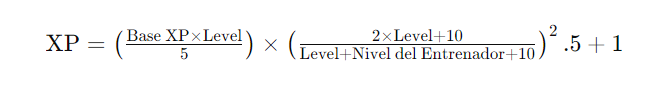
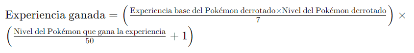

# POKEMON SANTIAGO - Trama
## Inicio

Elementos:
* estudiante
* abuela
* profesor Milanes
* starter
* Aprender basicas juego

Objetivos:
* Aprender basicas
* Llegar al tren
* vencer al Team Delete Cascade (TDC)
* Eliminar x pokemon z veces

## Segunda parte

Elementos:
* Rival(Compañero de piso)
* Estudiantes
* Dinero
* Instituto

Objetivos:
* Obtener el pago del piso (vencer gente random)
* Conoce al rival
* Superar prueba de admisión (Testeo total de tu capacidad como programador pokemon)
* Adquirir medalla admisión

## Tercera parte

Elementos:
* Tren
* Torneo Cambados {MUY OPCIONAL}
* ZONA CAPTURA
* Helicoptero apache de combate

Objetivo:
* Sobrevivir a la falta de dinero.
* Sobrevivir a base de pagar por curas [NO HAY LUGAR DE RECUPERACIÓN]
* Capturar [optativo]
* Ganar enemigos.
* Obtener medalla BLISS
* Volver
## FINAL[OBLIGATORIO]

Objetivos:
* Vencer TDC
* Vencer a 3 profes seguidos sin descansos [MINI LIGA POKEMON]
* Adquirir medalla NAVIDAD
* LLegar a fin de año
* Regalo para la abuela
* Recibir amenaza de la lider del TDC

# IMPORTANTE

Experiencia Maxima

Calculo de experiencia obtenida
