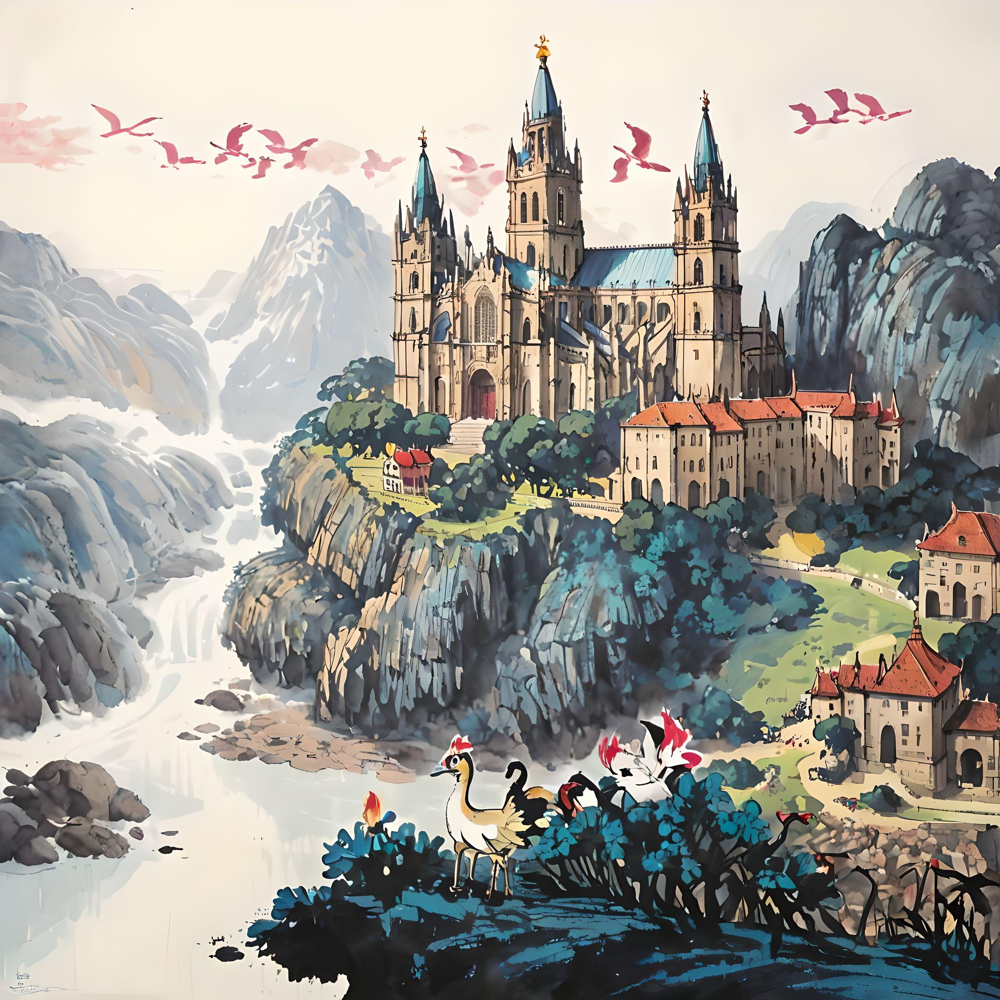

# Proyecto fin de ciclo

> _TODO_: Este documento será a páxina de inicio do teu proxecto. Será o primeiro que vexa quen se interese por el. Coida a súa redacción e ortografía. Vai eliminando as liñas "_TODO_" a medida que completes a redacción de cada apartado. Inclúe neste apartado o título do proxecto e a autoría.

## Descrición

Mi aplicación se llama `Pokémon Santiago de Compostela`. En este proyecto se va a desarrollar un videojuego que utiliza elementos de la enorme saga de juegos `Pokémon`, en el que el jugador es un **Estudiante de Programación Pokemon** (EPP) de Santiago de Compostela y debe superar su etapa estudiantil. Para ello, tendrá que enfrentarse a numerosas pruebas que desarrollará el profesorado del centro y tendrá que llegar a final de mes con el dinero suficiente para poder vivir en Santiago, avanzando así en la trama. El juego actualmente acabaría en el primer trimestre estudiantil.

## Sobre a autoría

> _TODO_: Realiza unha breve descrición de quen es (perfil profesional), puntos fortes, tecnoloxías que máis dominas... e os motivos que te levaron a elaborar este proxecto. **Non máis de 200 palabras**.

Como creador de este proyecto, Iván Cabaleiro Poceiro, declaro mi autoría en este. Soy un programador Junior, que empezó en el mundillo de la programación no hace mucho. Vengo de realizar el ciclo medio de `Sistemas Microinformáticos y Redes` (SMR) y estoy en camino de obtener el superior de `Desenvolvimiento de Aplicaciones Multiplataforma`, estando ya en mi segundo año en el IES San Clemente (Santiago de Compostela).

Principalmente domino los **lenguajes de programación**: Java, C# y Kotlin. También controlo, en menor medida, Python, y controlo algunos lenguajes web (HTML, CSS...) y sé trabajar en bases de datos. Además, manejo de manera adecuada el Git, que tanto nos han ayudado a realizar este proyecto a mis compañeros y a mi.

En mi etapa como estudiante he llegado a manipular **herramientas** como Unity, Android Studio, Visual Studio Code, NeatBeans, IntelliJ, entre otras, para los trabajos impuestos.

**Mi objeto final** con este proyecto es aplicar todo lo aprendido durante estos dos años y crear mi propio juego basado en la gran saga de Pokemon que marco mi infancia y la de muchos.

## Licencia

[Licencia](./LICENCE)

## Índice

1. [Estudo preliminar](doc/templates/1_estudo_preliminar.md)
2. [Análise](doc/templates/2_analise.md)
   - [Planificación](doc/templates/21_planificacion.md)
   - [Orzamento](doc/templates/22_orzamento.md)
3. [Deseño](doc/templates/3_deseño.md)
4. [Codificación e probas](doc/templates/4_codificacion_probas.md)
5. [Manuais do proxecto](doc/templates/5_manuais.md)
   - [Referencias](doc/templates/51_referencias.md)
