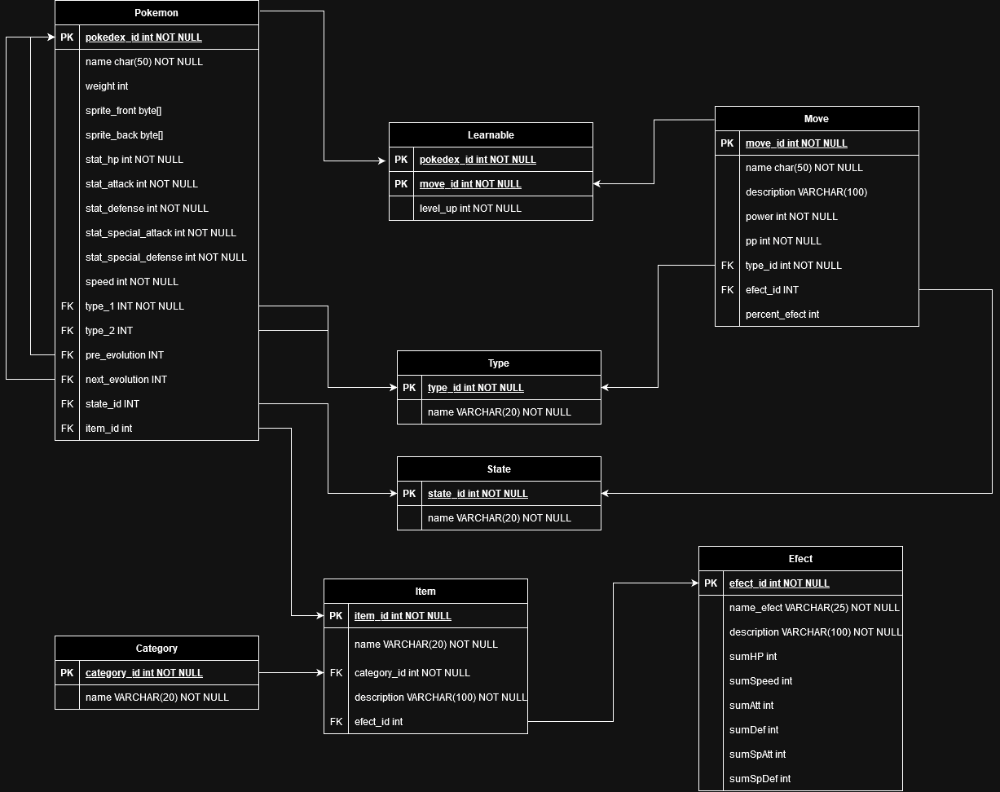
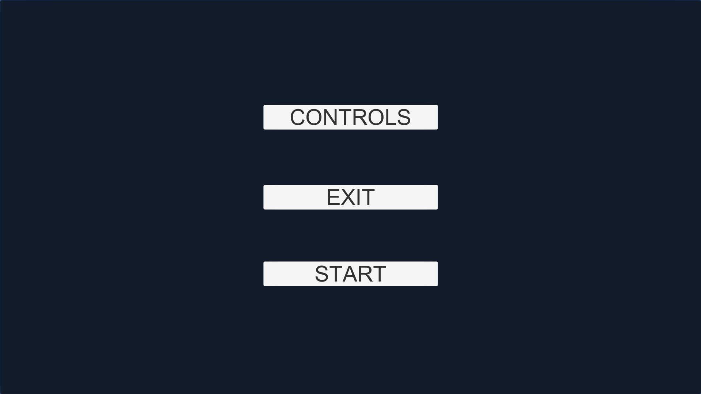
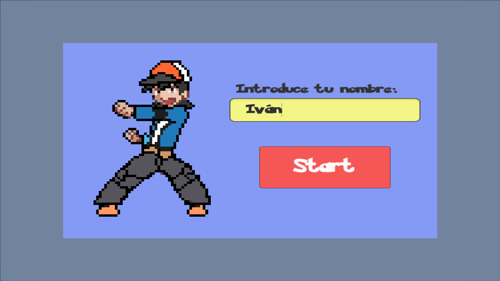
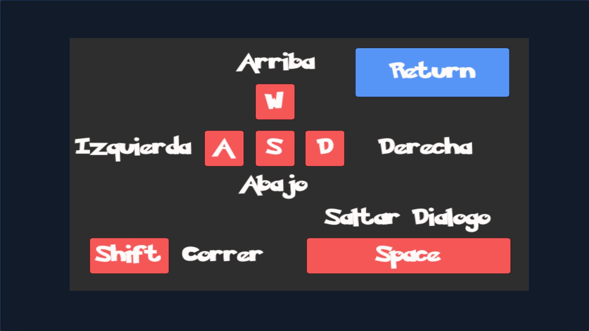
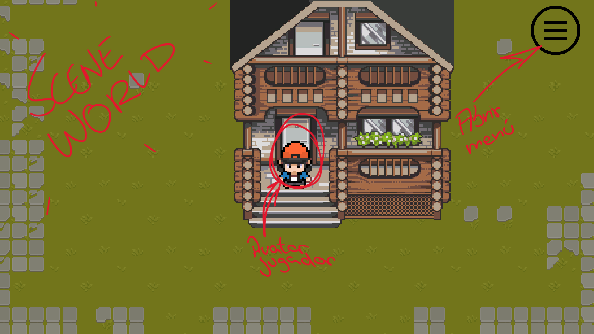
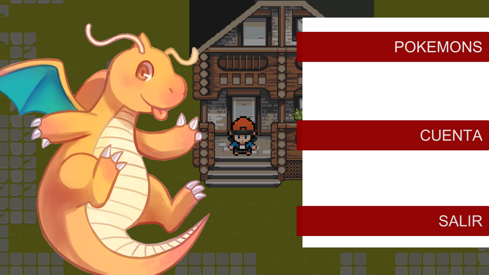
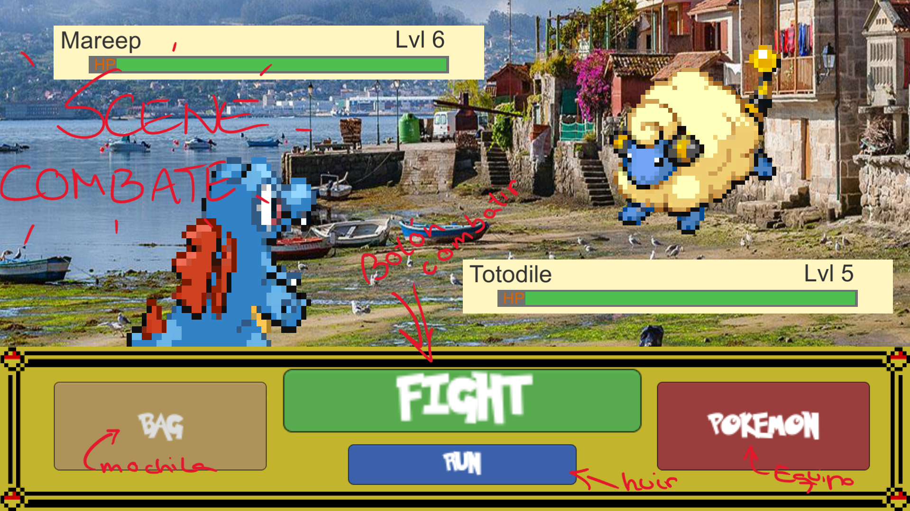

# Deseño

## Diagrama da arquitectura

El usuario interactuará con el juego a partir de botones que lo llevarán a diferentes ventanas. Desde el inicio se podrá empezar nueva partida o continuar con la anterior. Desde ese momento ya se tendría contacto con la base de datos.

Luego se distribuiría entre diferentes menus tambien interactivos para mayor comodidad y tendrá interfaces de combate muy sencillas

## Diagrama de Base de Datos

Diagrama Relacional
[Opcional]* Si me da tiempo puede que implemente a NPCs en la base de datos con sus dialogos y sprites

Diagrama entidad Relación

## Deseño de interface de usuarios

### Menú de Inicio/Titular

### Opciones de nuevo juego

### Iniciar al jugador

### Menú de Controles

### Vista del mundo

### Menu de juego

### Interfaz de combate

